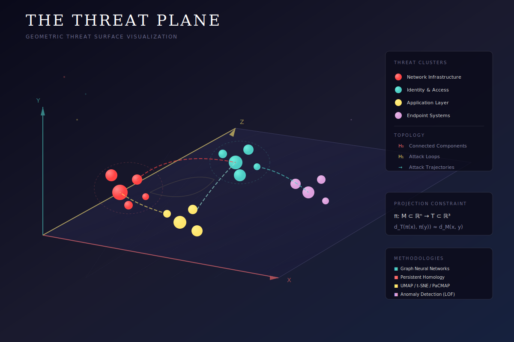
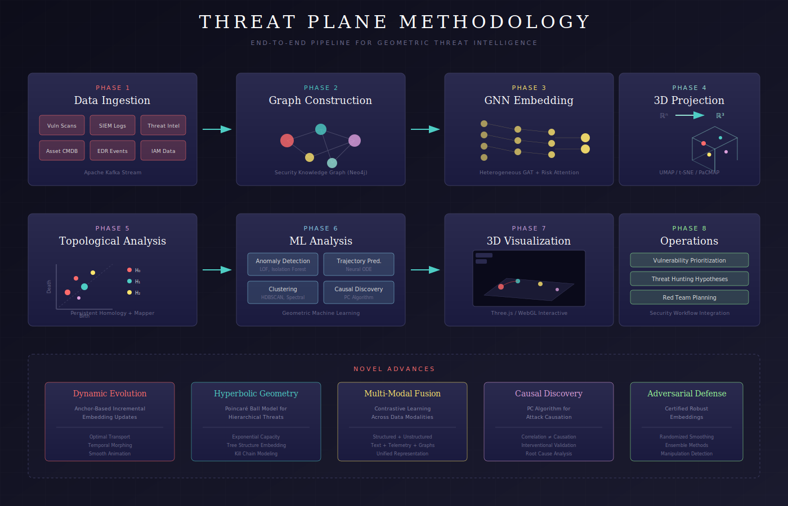

# The Threat Plane

<p align="center">
  
</p>

<p align="center">
  <strong>A Geometric Framework for Modeling and Visualizing Organizational Cyber Risk in Three-Dimensional Space</strong>
</p>

<p align="center">
  <a href="#overview">Overview</a> •
  <a href="#key-concepts">Key Concepts</a> •
  <a href="#methodology">Methodology</a> •
  <a href="#demo">Interactive Demo</a> •
  <a href="#getting-started">Getting Started</a> •
  <a href="#citation">Citation</a>
</p>

---

## Overview

The **Threat Plane** is a novel geometric framework that reconceptualizes organizational cyber risk as a navigable three-dimensional manifold. By synthesizing graph neural networks, topological data analysis, advanced dimensionality reduction techniques, and real-time telemetry integration, we propose a unified methodology for projecting the high-dimensional attack surface onto an interpretable 3D space.

This representation enables security teams to:

- 🎯 **Identify emergent threat clusters** through spatial proximity
- 🛤️ **Predict attack trajectories** using geodesic paths
- 🕳️ **Quantify defensive coverage gaps** via topological voids
- 🔗 **Discover hidden correlations** between disparate vulnerabilities

> *"An adversary does not traverse a tree; they navigate a manifold."*

## Key Concepts

### The Threat Manifold Hypothesis

The space of all possible security states for an organization forms a high-dimensional manifold **M** embedded in ℝⁿ. The Threat Plane is a lower-dimensional projection **π: M → ℝ³** that preserves essential topological and geometric properties:

```
π: M ⊂ ℝⁿ → T ⊂ ℝ³  subject to  d_T(π(x), π(y)) ≈ d_M(x, y)
```

### Topological Security Analysis

| Betti Number | Topological Feature | Security Interpretation |
|--------------|---------------------|------------------------|
| **H₀** | Connected Components | Distinct threat clusters / risk domains |
| **H₁** | Loops / Cycles | Cyclic attack dependencies (feedback loops) |
| **H₂** | Voids / Cavities | Regions of defensive coverage |

### Security Knowledge Graph

A heterogeneous graph integrating:

- **Node Types**: Assets, Vulnerabilities, Threat Actors, Techniques (ATT&CK), Controls, Identities
- **Edge Types**: EXPOSES, EXPLOITS, USES, TARGETS, PROTECTS, MITIGATES, LATERAL_MOVE

## Methodology

<p align="center">
  
</p>

### 8-Phase Pipeline

| Phase | Component | Technologies |
|-------|-----------|--------------|
| 1 | **Data Ingestion** | Apache Kafka, vulnerability scanners, SIEM, threat intel feeds |
| 2 | **Graph Construction** | Neo4j, entity resolution, relationship inference |
| 3 | **GNN Embedding** | PyTorch Geometric, heterogeneous GAT, risk-aware attention |
| 4 | **3D Projection** | UMAP, t-SNE, PaCMAP with geodesic regularization |
| 5 | **Topological Analysis** | Persistent homology, Betti numbers, Mapper algorithm |
| 6 | **ML Analysis** | Anomaly detection (LOF), trajectory prediction (Neural ODE), clustering |
| 7 | **Visualization** | Three.js, WebGL, interactive semantic overlays |
| 8 | **Operations** | Vulnerability prioritization, threat hunting, red team planning |

### Novel Advances

- **Dynamic Evolution**: Anchor-based incremental embedding with optimal transport morphing
- **Hyperbolic Geometry**: Poincaré ball embeddings for hierarchical threat structures
- **Multi-Modal Fusion**: Contrastive learning across structured/unstructured data
- **Causal Discovery**: PC algorithm for distinguishing correlation from attack enablement
- **Adversarial Robustness**: Certified robust embeddings via randomized smoothing

## Demo

### Interactive 3D Visualization

> **[▶️ View Interactive Demo](https://yourusername.github.io/threat-plane/visualizations/interactive-demo.html)** *(deploy to GitHub Pages to enable)*

To run the demo locally:

```bash
# Clone the repository
git clone https://github.com/Bodhi8/threat-plane.git
cd threat-plane

# Option 1: Open directly in browser
open visualizations/interactive-demo.html

# Option 2: Serve with Python (for full functionality)
python -m http.server 8000
# Then visit: http://localhost:8000/visualizations/interactive-demo.html
```

**Demo Features:**
- Real-time 3D threat landscape navigation
- Cluster filtering and highlighting  
- Attack path visualization
- Topology overlay controls
- Severity-based node sizing

### Deploy to GitHub Pages

To host the live demo:

1. Go to your repo **Settings** → **Pages**
2. Set Source to **main branch** and folder to **/ (root)**
3. Your demo will be live at: `https://yourusername.github.io/threat-plane/visualizations/interactive-demo.html`

## Getting Started

### Prerequisites

For the full pipeline implementation:

```bash
# Python dependencies
pip install torch torch-geometric networkx umap-learn scikit-learn gudhi plotly

# Graph database (optional)
docker run -p 7474:7474 -p 7687:7687 neo4j:latest
```

### Installation

```bash
# Clone the repository
git clone https://github.com/yourusername/threat-plane.git
cd threat-plane

# Install in development mode
pip install -e .

# Or with all dependencies
pip install -e ".[full]"
```

### Quick Start

```python
from threat_plane import ThreatPlane, SecurityKnowledgeGraph

# Build the security knowledge graph
skg = SecurityKnowledgeGraph()
skg.ingest_vulnerabilities("data/vuln_scan.json")
skg.ingest_assets("data/cmdb_export.csv")
skg.ingest_threat_intel("data/misp_feed.json")
skg.compute_attack_paths()

# Generate the threat plane
tp = ThreatPlane(skg)
tp.train_gnn(epochs=100)
tp.project_to_3d(method="umap")
tp.compute_topology()

# Visualize
tp.render_interactive()

# Analysis
anomalies = tp.detect_anomalies(method="lof")
trajectories = tp.predict_trajectories(start_node="compromised_host")
clusters = tp.cluster_threats(method="hdbscan")
```

### Run the Example

```bash
cd src/examples
python basic_usage.py
```

### Example: Analyzing a Threat Cluster

```python
# Find the most dangerous cluster
cluster_risks = tp.compute_cluster_risks()
critical_cluster = max(cluster_risks, key=cluster_risks.get)

# Get attack paths through this cluster
paths = tp.get_attack_paths_through(critical_cluster)
for path in paths[:5]:
    print(f"Path: {' → '.join(path.nodes)}")
    print(f"  Risk Score: {path.risk:.2f}")
    print(f"  Geodesic Length: {path.geodesic_distance:.2f}")
```

## Project Structure

```
threat-plane/
├── README.md
├── LICENSE
├── CONTRIBUTING.md
├── pyproject.toml
├── docs/
│   └── article.md              # Full research article
├── src/
│   ├── threat_plane/
│   │   ├── __init__.py         # Main ThreatPlane class
│   │   ├── graph.py            # Security Knowledge Graph
│   │   ├── embedding.py        # GNN embeddings
│   │   ├── projection.py       # Dimensionality reduction
│   │   ├── topology.py         # Topological analysis
│   │   └── visualization.py    # 3D rendering
│   └── examples/
│       └── basic_usage.py      # Working demo script
├── visualizations/
│   ├── interactive-demo.html   # Standalone 3D visualization
│   └── components/
│       └── ThreatPlane.jsx     # React component
└── assets/
    ├── threat-plane-diagram.svg
    └── threat-plane-architecture.svg
```

## Research Applications

This framework has applications in:

- **Vulnerability Management**: Prioritize remediation based on attack path convergence
- **Threat Intelligence**: Correlate indicators across the threat landscape
- **Red Team Operations**: Plan engagement strategies via geodesic paths
- **Security Architecture**: Identify segmentation opportunities via topology
- **Risk Quantification**: Measure exposure using manifold geometry

## Citation

If you use this work in your research, please cite:

```bibtex
@article{threatplane2025,
  title={The Threat Plane: A Geometric Framework for Modeling and Visualizing Organizational Cyber Risk},
  author={Your Name},
  journal={Medium},
  year={2025},
  url={https://medium.com/@yourusername/the-threat-plane}
}
```

## Contributing

Contributions are welcome! Please see [CONTRIBUTING.md](CONTRIBUTING.md) for guidelines.

Areas of interest:
- Additional dimensionality reduction techniques
- Real-time streaming updates
- Integration with security tools (Splunk, Elastic, etc.)
- Hyperbolic embedding implementations
- Causal discovery algorithms

## License

This project is licensed under the MIT License - see [LICENSE](LICENSE) for details.

## Acknowledgments

- MITRE ATT&CK® for the threat taxonomy
- The persistent homology community (GUDHI, Ripser)
- Three.js for 3D visualization capabilities

---

<p align="center">
  <sub>Built with ◆ for the security research community</sub>
</p>
